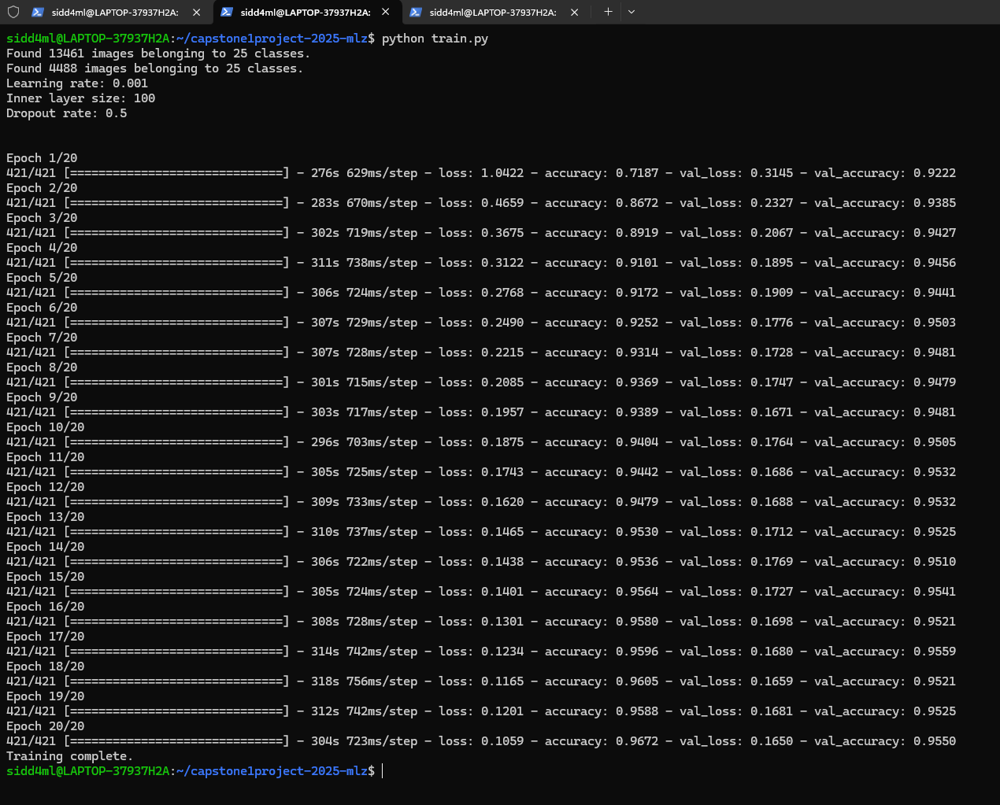
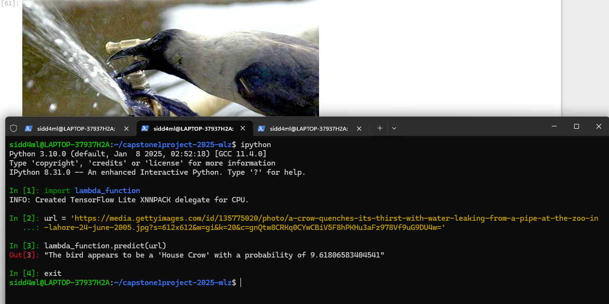

# Bird Image Classifier #

## Problem Description ##

**Context**

 The task of identifying bird species is traditionally performed by ornithologists and birdwatchers. However, manual identification is time-consuming, subjective, and requires a high level of expertise. The advent of machine learning and computer vision, particularly Convolutional Neural Networks (CNNs), provides an opportunity to automate this process, offering faster and more accurate identification, even for non-experts.

With advancements in image classification models, it is now possible to develop robust tools capable of recognizing and classifying bird species from photographs. This project aims to leverage these advancements to create a reliable and scalable bird species classification system tailored to the unique avian biodiversity of India.

**The Dataset**

 The dataset is sourced from Kaggle's "25 Indian Bird Species with 226k Images" dataset and can be found at  <https://www.kaggle.com/datasets/arjunbasandrai/25-indian-bird-species-with-226k-images/>. It contains labelled images of 25 different bird species commonly found in India. The dataset is organized into subdirectories, each representing a specific bird species, with numerous images capturing different poses, lighting conditions, and natural backgrounds.Key Attributes of the Dataset are:

 - **Species Diversity** : 25 Indian bird species, including both common and lesser-known species.
 - **Large Volume** : Over 226,000 images, ensuring the model is exposed to a wide variety of visual representations for each species.
 - **Real-World Conditions** : Images captured in natural settings, featuring different angles, lighting conditions, and backgrounds to ensure robustness.
 - **Operational Guidelines** : The dataset for this project has been downloaded onto my local machine. It has been unzipped to get the directory named **training_set** inside which there is another directory named **training_set**. This inner **training_set** directory has the image class subdirectories. Now, the top/outer **training_set** directory has been renamed to **dataset**. We shall work with this dataset directory. To keep original dataset untouched so that the EDA done on it could be reproduced, I made a copy of the dataset namely **temp_dataset** in which I did the cleaning/removing of the identified image files. Sunsequently I used this cleaned dataset **'temp_dataset'** to split the data into train, test & validation directories inside the original dataset (named **dataset**). After the operations, I removed the **temp_dataset**.
 
     

 ***Note :The dataset directory is more than 8 GB and could not push it to github even with Git LFS. So you have to get it from given link and use as per instruction above***
 

**The Problem**

 Accurate identification of bird species is essential for several reasons, including biodiversity conservation, ecological research, environmental monitoring, and educational purposes. However, there are several challenges in achieving this goal:

 - **Visual Similarities** : Many bird species have similar appearances, making it difficult for the untrained eye to differentiate between them.
 - **Image Variability** : Bird images can vary significantly in terms of pose, lighting, and background, adding complexity to the classification task.
 - **Lack of Expertise** : Not everyone has the expertise required to accurately identify bird species, creating a barrier to broader participation in conservation and citizen science efforts.

 Addressing these challenges through automation can help bridge the gap between experts and enthusiasts, democratizing access to bird identification tools and promoting greater engagement in conservation efforts.

**Solution: Project Objective**

 The primary objective of this project is to develop a Convolutional Neural Network (CNN) model capable of accurately recognizing and classifying a diverse range of bird species found in India. The model will be trained on the comprehensive dataset described above, ensuring robustness and generalizability across various real-world conditions.

 The proposed model aims to achieve:
 
 - **High Accuracy** : The CNN model will leverage transfer learning with Xception model pretrained on the ImageNet dataset to achieve accurate classification across all 25 bird species.
 - **Scalability** : The model will be designed to accommodate additional species in the future, making it adaptable to broader datasets.
 - **Actionable Insight** : The model will provide interpretable outputs, including confidence scores, to help users make informed decisions.

 Additionally, the successful development of this bird classification model offers a wide array of real-world applications:

 - **Wildlife Conservation and Research** : Assisting researchers and conservationists in monitoring bird populations and identifying endangered species. Automating the analysis of data collected from camera traps and drones in natural habitats.

 - **Eco-Tourism and Citizen Science** :  Enabling birdwatchers and eco-tourists to identify bird species in real-time using mobile or handheld devices. Supporting citizen science initiatives by allowing enthusiasts to contribute to bird population studies through accurate species identification.

 - **Environmental Monitoring** : Using bird species data as indicators of environmental health and biodiversity in specific regions. Facilitating early detection of ecological changes through shifts in bird populations or distribution.

 - **Educational Tools** : Providing an engaging learning resource for students and bird enthusiasts to study ornithology. Integrating with augmented reality (AR) applications for interactive bird identification in field settings.

 - **Urban and Rural Planning** : Informing planners about bird-friendly designs for urban parks and conservation areas. Promoting sustainable development practices by understanding bird species distribution in affected regions.

 
## Exploratory Data Analysis ##

 **For the exploratory data analysis, the image dataset has been subjected to the following:**

 - **Data Overview** : 
    - Exploring the Class Distribution 
    - Checking size of dataset and number & name of the classes 
    - Checking for corrupt files, Analyzing file formats in the dataset
    - Checking for duplicate image files across the classes in the dataset

 - **Visual Inspection of the dataset** : 
    - Display random image from each class/species
    - Assessing the quality of the image - Checking for blurry images in the dataset
    - Checking orientation of images in the dataset

 - **Image Property Analysis** :
    - checking image dimensions across the bird species/classes
    - checking image aspect ratios across the bird species/classes
    - Checking RGB channels for the images in the dataset
    - Analyzing perceived brightness in the images across classes in the dataset
    - Analyzing the contrast distribution in the images across classes in the dataset

 Based upon the EDA some Data Cleaning has been done on the temp_dataset (which is a copy of the original dataset). This has been done to keep original dataset untouched so that the EDA done on it could be reproduced. The data cleaning pertains to the removal of the following image files identified durig the EDA:
  - inconsistant format files
  - duplicate image files
  - blurry image files

 _These exercises could be found in my_ **_notebook_EDA.ipynb_**

## Model Training ##

 As a pre-requisite of the model training, I had to:

 - Use the cleaned data at the temp_dataset generated during EDA for generating a dataframe to convert temp_dataset directory paths to images and image labels into rows of the dataframe
 - Use train-test-split with stratify (to prevent class imbalance and keep original proportion of images in the classes at the split sets) to split the dataframe into full_train_df and test_df. Further, full_train_df is split into train_df and val_df so that train_df:val_df:test_df = 60:20:20
 - Then I copied the images mentioned in the 3 dataframes from temp_dataset to 3 new directories with respective names viz train, test & val created in the original dataset.
 - Then the temp_dataset was removed.
 - Finally loaded the images references from the train & val directories with the ImageDataGenerator

 Subsequently, the basic model architecture was created and the model trained for 10 epoch. Then the model training ensued for multiple variations in model architechture and tuning their parameters aligning closely the approach taught in our course tutorials which include the following:

 - Evaluating the best validation accuracy score for the model training with different learning rates
 - With the best evaluated learning rate, evaluating the best validation accuracy score for the model training with extra inner layer of different input sizes
 - With the best evaluated learning rate and extra inner layer best input size, evaluating the best validation accuracy score for the model training with different dropout rates.
 - Finally, a larger model of input size 299*299 is trained with the best learning rate, inner layer input size and dropout rate, the final model is saved with checkpointing.
 - This final model is then loaded and evaluated on the unseen test data (images in the test directory - needs to be loaded beforehand with the ImageDataGenerator)

 _These exercises could be found in my_ **_notebook_Training.ipynb_**

## Exporting the Training Notebook to Script ##

 1\. Model training of the best evaluated model with best model architechture and tuned parameters viz. learning rate, inner layer input size & dropuout rate have been exported from the notebook_Training.ipynb in the form of a script namely **train.py** Running this script will outcome:

   - Generation of model file(s) with increasing accuracy in the format **xception_v_script_<epoch_number>_<validation_accuracy>.h5** 
   - If in the training, after subsequent epochs, the validation accuracy increases, new model files with higher accuracy shall continue to get saved in the project directory.
   - After the model training is over, delete all the model files keeping on the one with the top accuracy.

 2\. From the notebook **notebook_tflite_Service.ipynb**, I created a **convert-model.py** script which takes in a Keras model and converts it to a TFLite model named **final_deployable_model.tflite**

 3\. From the notebook **notebook_tflite_Service.ipynb**, I also created a **lambda_function.py** script the lambda_handler in which when invoked with a image (bird) url, returns the most probable class/species of the bird with the probability. 

 

## Dependency and environment management ##

 _All project dependencies are listed in the_ **_requirements.txt_**

 1\. Go the your wsl environment from you powershell terminal with administrator privilege. You should land in your WSL home directory by default.

    wsl
    
 2\. If you do not have pyenv installed already, please install it and check for successful installation with

    pyenv -v

 3\. Install Python version 3.10.0 since it would be safe as I have created my project on version 3.10.0

    pyenv install 3.10.0

 4\. Now from your home directory at WSL, clone my GitHub project repository with the link I submitted

    git clone https://github.com/SapientSapiens/capstone1project-2025-mlz.git

 5\. Go inside that cloned directory

    cd capstone1project-2025-mlz

 6\. Set the python version for this project directory as 3.10.0

    pyenv local 3.10.0

 7\. You can see that the project directory shall have its own python version which can be different from the global version in your wsl environment. 
 
 
 
 8\. You can now install the dependenncies for this project from the requirements.txt file. These dependencies shall only be accessible to the virtual environement created by pyenv in the project folder. And you don't have to explicitly do anything to activate the environment created in the project with pyenv.

    pip install -r requirements.txt

 9\. After the model training is over and model conversion from keras to tflite is complete, you would need numpy version 1.23.1 and tflite_runtime. So you need to isntall them
     at that point of time (in my case, I did that from the notebook_tflite_Service.ipynb itself!)

       pip install numpy==1.23.1

       pip install --no-deps --extra-index-url https://google-coral.github.io/py-repo/tflite_runtime

## Reproducibility ##

 1\. Form within the project directory, run the jupyter notebook. From the Jupyter notebook GUI, you can open my notebooks **notebook_EDA.ipynb** and **notebook_Training.ipynb** and **notebook_tflite_service.ipynb** in the project directory and review them. Note: before running notebook_Training.ipynb remove the train, test & val folders inside the **dataset** directory, as the running the notebook re-creates them.

    jupyter notebook

 2\. From inside the project directory at WSL, kindly run the **train.py** script to train model on the image dataset at the train & val folders inside the **dataset** directory which is under the project directory and save the best validation accuracy model(s) as describe in the section ***Exporting the Training Notebook to Script*** above

    python train.py

 

  3\. From inside the project directory at WSL, kindly run the **convert-model.py** script to convert the model with best validation accuracy genratred with running train.py. One important thing to note here is you need to fillin the ***model_name*** variable in this script yourself: you choose the name of the best model generated when you run train.py for me the name is 'xception_v_script_17_0.956.h5 but for you it might be different name. So please change this variable with you model name.

    python convert-model.py

 

## Model Deployment ##

 1\. Please run the **ipython** command from the project directory and inside the ipyhton prompt, invoke the lambda_handler with the url of the bird image to be predicted. 

 

## Containerization ##

 1\. Install Docker Deskop on you machine (currently I have Docker Desktop version 4.35.0 on my Windows 11 machine). If you have other set up, you may install docker accordingly (Mac/Linux/Windows 10)

 2\. In the settings of Docker Desktop, in the 'General' tab/menu please ensure you have "Use the WSL 2 based engine (Windows Home can only run the WSL 2 backend)" checked/ticked

 3\. Again, in the settings, "WSL integration" sub menu in the "Resources" menu/tab, please ensure "Enable integration with my default WSL distro" is checked/ticked. Further ensure that the "Enable integration with additional distros:" slider button is turned on.

 4\. Start the Docker Engine in the Docker Desktop, if not already started.

 5\. Now from the project directory in the WSL, issue the command to build the docker image. The image would be built as mentioned in the submitted **Dockerfile**.

    docker build -t capstone1-mlz .

  6\. After the image is built and the application successfully containerized, we can list the image from the WSL by following command

    docker images

 

 7\. Now run the containerized application from the project folder

    docker run -it --rm -p 9696:9696 capstone1-mlz

  

 8\.  Now activate virtual environment in another WSL tab from inside the project directory and run the **test.py**  from inside the project directory to get the **predict** service from the containerized application

    python test.py

 

## Cloud Deployment ##

 1\. **Publishing the image to AWS ECR**
   
 - Install awscli

       pip install awscli

 - Create AWS Elastic Container Registry repository and log in to the same. You may have to configure with aws configure prior to this, if not done already.

       aws ecr create-repository --repository-name capstone1-mlz

 - After creation of the ECR repository, set the variables for REMOTE_URI to the ECR

       ACCOUNT=230579966543
       REGION=eu-north-1
       REGISTRY=capstone1-mlz
       PREFIX=${ACCOUNT}.dkr.ecr.${REGION}.amazonaws.com/${REGISTRY}
       TAG=capstone1-model-ver-lambda01
       REMOTE_URI=${PREFIX}:${TAG}

       echo ${REMOTE_URI}

 - Tag the Docker image built on the local machine and push it to the ECR

       docker tag capstone1-mlz:latest ${REMOTE_URI}

       docker push ${REMOTE_URI}

     

 - After the image has been pushed to the ECR repository, it shows there
 
      

 2\. **Create a lambda function in AWS, using the ECR image**

 - Create the AWS Lambda function choosing options as Container Image 

 - Select the required container image from the ECR repository, i.e., ***capstone1-model-ver-lambda01***

 - You should get the lambda function created shown as below

     

 3\. **Test the lambda function created**

 - Edit basic settings to increase Memory to 1024 MB and timeout to 30 seconds

 - Then test the lammbda function by creating & saving a Test Event 
 
 - I used the url of the house crow used in our test script for creating the Test Event. The test shows the correct result:

     

 4\. **Expose the lambda function using API Gateway**

  - Open the AWS API Gateway section and first create a new REST API

  - Now create a resource for the created API

  - Subsequently, create a Method for the Resource with method type as POST

  - After Method is created, you can deploy the API by creating a stage

  - We can see the stage ('test' in our case) has been created and the URL for public access of the API is generated here. 
    The genrated invoke url is given below but AWS API Gateway and Lambda services might not be running by the time you are 
    testing it as shall incur cost.

       <https://mb74pfois9.execute-api.eu-north-1.amazonaws.com/test>

     

 5\. **Testing the Lamda function with the API**

  - A test script cloud_test.py is created for testing the Lambda Function through the API from the gateway.

     

  - Let us try again with a new bird from the 25 species. Let us take the Sarus Crane. Apart from a picture of Sarus Crane not in the dataset, 
    I found a complex picture where the are  are accompanying objects in similar pose which can be challenging for the model. Kindly check this 
    image of the Sarus Crane <https://static.theprint.in/wp-content/uploads/2023/03/Untitled-design-11-1.jpg?compress=true&quality=80&w=376&dpr=2.6>  
    Now, let us change the input image url in the cloud_test.py script and run it. We can see the model correctly predicts the bird.

     

